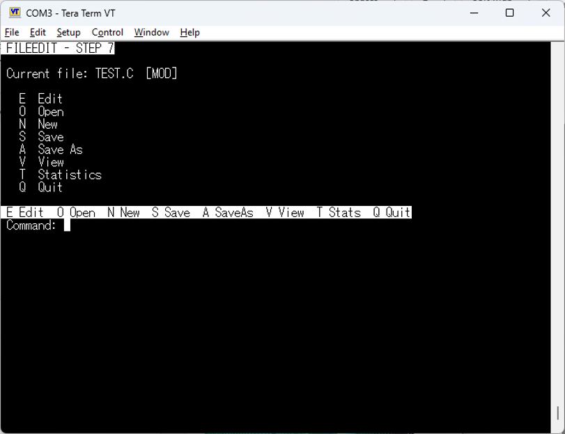
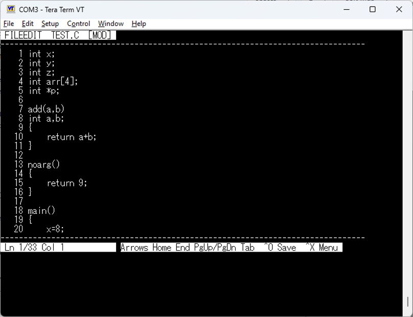

# FileEdit for the TMS9900/TMS99105 SBC

FileEdit is a small full-screen text editor for a TMS9900-family
single-board computer, designed for use through a VT100/ANSI terminal
such as Tera Term.

It began as **FILESTAT**, a technical tutorial project demonstrating a
resident kernel with mapped code overlays. It then evolved milestone by
milestone into an editor while retaining the original file-statistics
functionality.

## Current milestone

This GitHub package is based on **Step 7.1.6**.

Current features include full-screen VT100/ANSI editing, a display-only
line-number gutter, cursor navigation, insertion/deletion, real ASCII
TABs, Open/New/Save/Save As, `[MOD]` dirty-state indication, rolling
`.BAK` backups, post-save verification, the original FILESTAT
statistics, five mapped code overlays, and interrupt-buffered TMS9902
receive input using a 64-byte resident ring.

`FILESTAT.EXE` is still produced as a byte-identical compatibility
alias, but **FILEEDIT.EXE** is the primary application.

## Screenshots

### FileEdit main menu



The main menu provides Edit, Open, New, Save, Save As, View, Statistics and Quit while retaining the current document in resident editor state.

### Full-screen editor with display-only line numbers



The editor runs directly in the VT100/ANSI terminal. The line-number gutter is rendered by `OVL_VIEW`; the numbers are not part of the document and are never saved. The status line shows the logical line/column and the principal navigation and save commands.

## Typical use

``` text
FILEEDIT TEST.C /E
FILEEDIT /E
```

The original analyser modes remain:

``` text
FILEEDIT TEST.C
FILEEDIT TEST.C /L
FILEEDIT TEST.C /V
```

## Editor keys

  Key           Action
  ------------- -----------------------------------
  Arrow keys    Move cursor
  Home / End    Start / end of logical line
  PgUp / PgDn   Move by a screen
  Tab           Insert a real ASCII `09` TAB
  Backspace     Delete character to the left
  Delete        Delete character under the cursor
  Enter         Split the line
  Ctrl-O        Save and verify
  Ctrl-X        Return to the FileEdit menu

Line numbers are rendered screen decoration. They are not stored,
editable, saved, or included in FILESTAT statistics.

## Architecture

``` text
>1000-7FFF   resident kernel, editor state, file I/O,
             terminal services and TMS9902 RX queue
>8000-8FFF   one mapped code overlay at a time
>9000-BFFF   persistent editor text arena
>C000-FFFF   system / shell / BDOS / MONITOR
```

Overlay assignments:

``` text
page 2   OVL_WORD   statistics word/line pass
page 3   OVL_CHAR   character-class pass
page 4   OVL_RPT    report formatter
page 5   OVL_VIEW   viewer/editor frame renderer
page 6   OVL_EDIT   key decoding and editing operations
```

DREL generates overlay address tables and lints relocation chains,
catching overlay-size violations and illegal overlay-to-overlay
dependencies before code reaches the SBC.

## TMS9902 receive architecture

Blocking console input worked until full-screen scrolling became
expensive enough for bytes of VT100 cursor-key sequences to be lost.
`ESC [ B`, for example, could be reduced to a lone `B` and inserted into
the document.

FileEdit now temporarily hooks the writable **INT4 handler PC at
`>0012`**, retaining the MONITOR's existing INT4 workspace at `>0010`.

``` text
Tera Term
   |
TMS9902
   |
INT4
   |
FileEdit RXISR
   |
64-byte resident ring
   |
TERMIO / ANSI decoder
   |
OVL_EDIT
```

The ISR is pure assembly: no C calls, BDOS calls, stack use, terminal
output, disk work, or overlay mapping. Because interrupt entry switches
workspace, it explicitly loads `R12` with the TMS9902 serial CRU base
`>0080`.

For a received byte it inhibits/acknowledges receiver interrupts with
`SBZ 18`, drains the receive buffer with `STCR`, queues the byte, and
re-arms the receiver with `SBO 18`.

FileEdit then **always chains to the previously installed INT4
handler**. The previous owner remains responsible for timer or other
INT4 work and performs the final `RTWP`. FileEdit therefore adds an RX
service without claiming exclusive ownership of INT4.

The `/I` diagnostic independently proves the INT4 hook using the
known-working TMS9902 interval timer:

``` text
FILEEDIT /I
```

Expected:

``` text
FILEEDIT INT4 timer-hook test...
Waiting for 8 TMS9902 timer interrupts.
PASS - INT4 hook received 8 timer interrupts.
```

## Save safety

For an existing target FileEdit first makes a `.BAK`, writes the editor
contents, closes and reopens the file, and verifies it against the RAM
document. Dirty state is cleared only after verification succeeds.

## Building

The supplied Windows-hosted toolchain contains:

-   `smallcp.exe`
-   `r99.exe`
-   `drel.exe`
-   `link99.exe`

From the project root run:

``` powershell
.\make_SBC_filestat99.ps1
```

The script stages inputs into `build\`, compiles resident modules and
overlays, runs DREL chain lint, generates overlay tables, checks
one-page overlay budgets, links, and writes:

``` text
dist\FILEEDIT.EXE
dist\FILESTAT.EXE
dist\SAMPLE.TXT
```

The script also deploys to a sibling MONITOR workspace. Adjust
`$MonitorDir` if your checkout layout differs.

## Repository layout

``` text
src\resident\      resident C and assembly modules
src\overlays\      mapped code overlays
include\           overlay definitions
lib\               runtime objects and libraries
tools\             compiler/assembler/DREL/linker
tests\             repeatable sample input
docs\              architecture and milestone notes
build\             disposable build directory
dist\              final executable output
```

## Hardware assumptions

The current build assumes a TMS9900-family/TMS99105-compatible SBC,
TMS9902 at serial CRU base `>0080`, its interrupt connected to CPU INT4,
writable interrupt vectors in common RAM, the MONITOR-provided INT4
workspace/timer service, the existing BDOS interface, and VT100/ANSI
terminal behavior compatible with Tera Term.

## Documentation

The repository deliberately preserves the development/tutorial history.
Particularly useful files are:

-   `docs/STEP6_3_OVLEDIT.TXT` --- introduction of the fifth overlay;
-   `docs/STEP7_FILEEDIT.TXT` --- FileEdit rename and display-only
    line-number gutter;
-   `docs/STEP7_1_INT4RX.TXT` --- interrupt-driven receive development;
-   `docs/MEMMAP.TXT` --- current memory and overlay map;
-   `EDITSTEP*.TXT` --- short hardware bench-test cards.

## Status and next step

Editing, file management, backup/verification, line numbers, TAB
handling, rapid navigation and interrupt-buffered receive have been
exercised on the target SBC.

The next planned editor feature is **Find / Find Next**.

## Historical note

Internal source names such as `FILESTAT.C` are intentionally retained.
FILESTAT is the project's origin and remains the statistics subsystem;
renaming every internal module would add churn without improving the
architecture.
