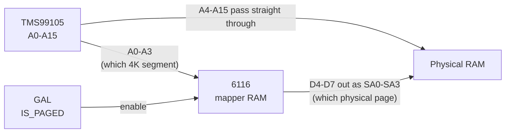
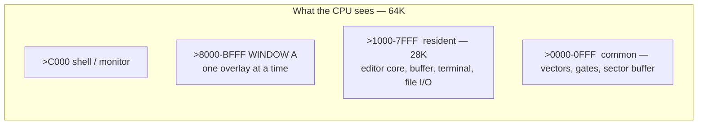
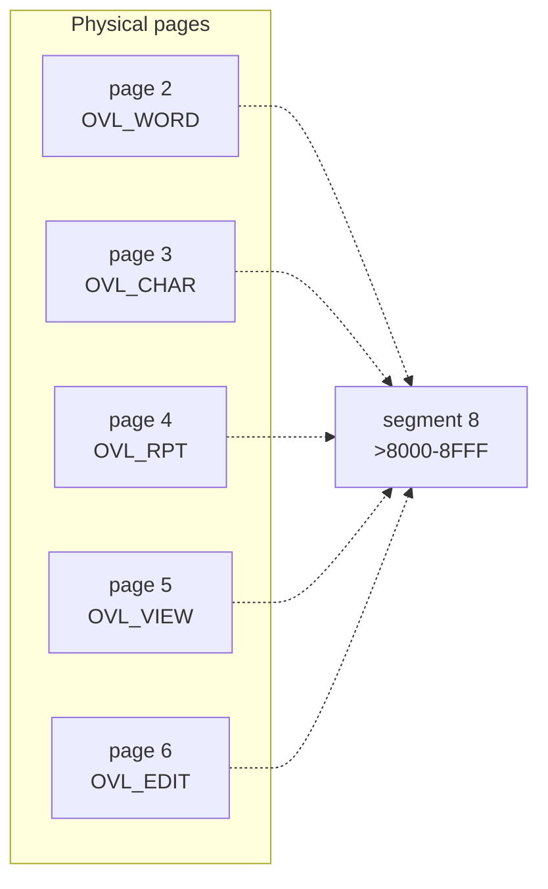
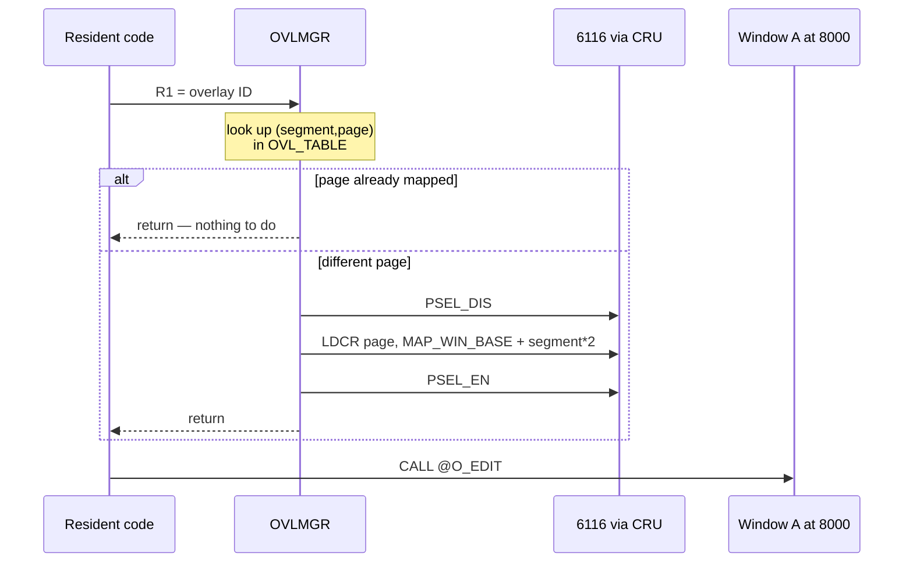

# Transparent memory mapping on the TMS99105 SBC

The CPU can address 64K. The board has more RAM than that. A 6116 mapper sits
between them and quietly rewrites the top four address lines, so a program can
use far more memory than it can address — without knowing it.

FileEdit is the worked example: an editor whose code is roughly twice the size
of the space it occupies.

---

## The hardware: one chip, four wires



The 64K address space is sixteen 4K **segments**. Physical RAM is a larger set
of 4K **pages**. The mapper holds one page number per segment; `A0-A3` select
the entry, and its `D4-D7` become the real address's top bits. `A4-A15` are
untouched, so the offset within a 4K block never changes.

A GAL decides which segments are mapped at all:

```
IS_PAGED = (A0 & !A1) # (A1 & !A2) # (A2 & !A0) # (A3 & !A0)
```

| Segments | Behaviour |
| --- | --- |
| 0 (`>0000-0FFF`) | **Common** — always physical page 0 |
| 1–D (`>1000-DFFF`) | **Paged** — whatever the mapper says |
| E, F (`>E000-FFFF`) | **Common** — BDOS and ROM, always present |

Common segments matter more than they look. Code that changes the map cannot
live in a segment it is changing, so the gates that switch pages sit in segment
0, and the BDOS stays reachable no matter what the mapper is doing.

---

## FileEdit's address space



The resident 28K is always there: the edit buffer, the menu, terminal handling,
the file layer, and the overlay manager itself. Only window A changes.

---

## Five overlays, one window



Every overlay is compiled to run at `>8000`. Only one is mapped at a time, and
the choice is a single CRU write.

| ID | Overlay | Entry | Job |
| --- | --- | --- | --- |
| 1 | OVL_WORD | `>80DC` | word scan |
| 2 | OVL_CHAR | `>8000` | character scan |
| 3 | OVL_RPT | `>8000` | statistics report |
| 4 | OVL_VIEW | `>83EC` | full-screen viewer |
| 5 | OVL_EDIT | `>8BF0` | the editor itself |

The five together are about 11K of code sharing 4K of address space. The
manager also supports up to five `(segment, page)` pairs per overlay, so one
overlay can span a contiguous 16K window when it outgrows a single page —
FileEdit doesn't currently need that.

---

## Calling into an overlay



From the caller it is two lines:

```
    LI   R1,OVL_EDIT
    CALL @OVLMGR
    CALL @O_EDIT
```

`OVLMGR` keeps a `CURRENT_PAGE` entry per segment and returns immediately if
the page it wants is already there, so a repeated call into the same overlay
costs a compare, not a remap.

---

## Why this is worth the trouble

- **The compiler never knows.** Every overlay is ordinary C compiled to run at
  `>8000`. No far pointers, no banking annotations, no special calling
  convention.
- **Swapping is a CRU write.** No copying, no disk access. The pages are loaded
  once when the program starts and simply mapped in and out.
- **Direct calls within an overlay.** Pages of one overlay are co-resident, so
  code inside it calls itself normally. Only calls *between* different overlays
  are forbidden — and those go through the manager.
- **The address is stable.** `A4-A15` pass through untouched, so an address
  inside a page means the same offset whichever page is mapped. That is what
  makes the relocation trivial.

The cost is one rule: two overlays are never present at once, so nothing in one
may call directly into another. The build enforces the layout — DREL generates
`OVLADDR.INC` and `OVLTABLE.INC` from the linked objects, so the table and the
entry points cannot drift apart by hand.

---

## Where each piece lives

| File | Role |
| --- | --- |
| `OVLMGR.A99` | the manager — table walk and the CRU write |
| `OVLAPI.A99` | fixed entry slots the resident code calls |
| `OVLADDR.INC` | generated: overlay ID → entry address |
| `OVLTABLE.INC` | generated: overlay ID → `(segment, page)` pairs |
| `src/overlays/*.C` | the overlays themselves, plain C |
| `src/resident/*.C` | everything that must always be present |
