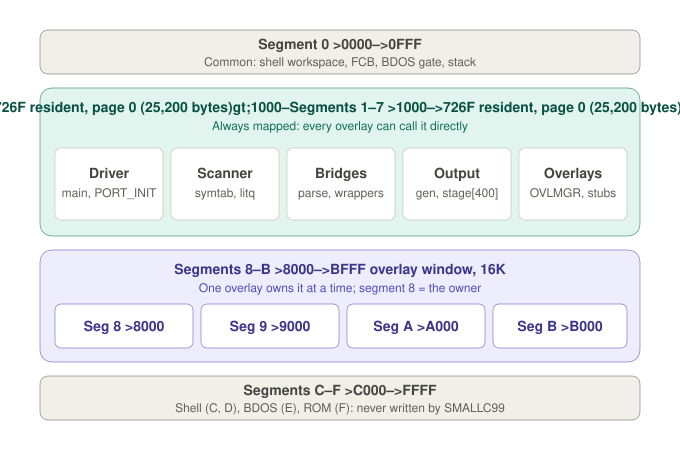
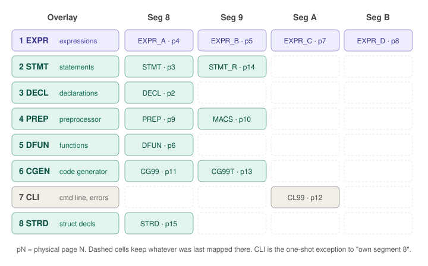

# SBC_SMALLC99 — a native C compiler for the TMS99105 SBC


SMALLC99 is a C compiler that runs **on** the TMS99105 SBC V4 and produces
TMS9900 assembly for the SBC's own assembler (`R99`) and linker (`LINK99`).
It descends from J. E. Hendrix's Small-C 2.2, and extends it with structures
and unions, multi-level pointers, multi-dimensional arrays, and error reporting.

The compiler is far larger than the 64K the processor can address, so it is
built as a small **resident** part plus **overlays** that are swapped through
a 16K window by the SBC's memory mapper.

```
[TOOLS]%SMALLC99 PTRTEST -V
SMALLC99: compiling PTRTEST.C -> PTRTEST.A99
SMALLC99: wrote PTRTEST.A99
[TOOLS]%R99 PTRTEST
[TOOLS]%LINK99 PTRTEST.R99 IOLIB99.LIB
[TOOLS]%PTRTEST
...
tests: 44  passed: 44  failed: 0
ALL POINTER TESTS PASSED
```

---

## Status

| Test (in `tests/`) | Checks | Result on the SBC |
|---|---|---|
| `LANGTEST_LANGUAGE.C` — the core language | 133 | all pass |
| `STRUCTTEST.C` — structures and unions | 60 | all pass |
| `PTRTEST.C` — pointers to pointers, arrays of pointers | 44 | all pass |
| `ARRTEST.C` — multi-dimensional arrays | 50 | all pass |
| `ERRTEST.C` — error reporting | 3 planted errors | all reported |

---

## The language

### Supported

- **Types:** `char`, `int`, `unsigned char`, `unsigned int` (16-bit);
  `struct` and `union`; pointers, including pointers to pointers (up to four
  levels, e.g. `int ****p`).
- **Arrays:** of any of the types above, with up to five dimensions
  (`int m[3][4]`, `int c[2][3][4]`), as globals, locals, struct members and
  parameters (`int a[][4]`). `m[i]` is the address of a row and can be passed
  as an `int *`; arrays of pointers (`char *words[10]`, `char *t[2][2]`) and
  arrays of structs (`struct pt grid[2][3]`) work in any number of dimensions.
- **Structures and unions:** global and local variables, `.` and `->`,
  nesting, member arrays, self-referencing lists
  (`struct node { int v; struct node *next; }`), pointers to structs as
  parameters, `sizeof(struct tag)`.
- **Declarations:** global, local (automatic) and `extern` variables;
  K&R-style function definitions (`add(a, b) int a, b; { ... }`); parameters
  such as `char **argv` or `char *argv[]`; initialisers for scalars, arrays and
  strings.
- **Operators:** the full C set — arithmetic, bitwise, shifts, relational,
  logical, `?:`, the comma operator, all compound assignments, `++`/`--`
  (prefix and postfix), unary `&` and `*`, `sizeof`, subscripts; pointer
  arithmetic scaled by the element size, including struct sizes and pointer
  differences.
- **Statements:** `if`/`else`, `while`, `do`/`while`, `for`, `switch`/`case`/
  `default`, `break`, `continue`, `goto` and labels, `return`, compound
  blocks with local declarations.
- **Functions:** recursion; calls through a function pointer `(*fp)()`;
  functions are untyped and return `int`, in classic Small-C style.
- **Constants:** decimal, hex, octal, character constants with escapes,
  strings.
- **Preprocessor:** `#define` (object-like), `#include` (one level),
  `#ifdef`/`#ifndef`/`#else`/`#endif`, `#asm`/`#endasm`.

### Not supported

| Feature | Notes |
|---|---|
| `long`, `float`, `double` | |
| Casts, `typedef`, `enum` | |
| `static`, `register` | |
| Typed function definitions (`int f() {}`, `char *f()`), forward declarations | Functions are declared implicitly on first use |
| `#if`, `#undef`, nested `#include` | |
| Macros with arguments | **Accepted but not expanded** — `SQ(3)` keeps `x`; avoid |
| Struct assignment, passing or returning structs by value, struct initialisers | Structs phase 2 |

### Capacities

| Limit | Value |
|---|---|
| Line length | 127 characters (longer lines are reported) |
| String literals per function | 255 bytes |
| Global symbols / local symbols | 140 / 25 |
| Struct tags + row types / struct members (all structs) | 16 / 40 (a row type such as `int[4]` is one tag entry, shared by every array with that row) |
| Nested calls between overlays | 16 (statement depth × expression depth) |

### Errors

Each error is reported once per statement, on the console and as a comment
in the output, with the line number and the source line:

```
*** line 3: no semicolon
    int c;
*** line 8: invalid expression
    c = (a + ;
SMALLC99: 2 errors
```

In the `.A99` file the same report appears as `;*** line 3: no semicolon`,
which the assembler ignores. An error inside an `#include` gives the line
number of the `#include`.

---

## Architecture

### Memory

The TMS99105 addresses 64K, divided into sixteen 4K segments. Behind every
segment sit sixteen physical pages (1MB in total), selected by a map register
per segment. SMALLC99 uses them like this:

<p align="center">
  
</p>

| Region | Contents |
|---|---|
| Segment 0 | Common memory: the shell's workspace, FCB, BDOS gate and stack |
| Segments 1–7 (`>1000`–`>7857`) | The resident compiler, always mapped: driver, scanner, symbol tables, output layer, overlay manager |
| `>7858`–`>7FFF` | The C run-time heap (file buffers; an `#include` needs ~1,700 bytes of it) |
| Segments 8–B (`>8000`–`>BFFF`) | The overlay window: one overlay owns it at a time |
| Segments C–F | The shell, the BDOS and the ROM — never written by the compiler |

### Overlays

<p align="center">
  
</p>

| ID | Overlay | Does |
|---|---|---|
| 1 | `EXPR` — expressions | Operators and precedence, function calls, member access, pointer scaling. Four pages mapped together as one 16K engine |
| 2 | `STMT` — statements | Control flow, local declarations |
| 3 | `DECL` — declarations | Global variables and their initial values |
| 4 | `PREP` — preprocessor | Reading source lines, `#define`, `#include`, `#ifdef`, `#asm`, macro table |
| 5 | `DFUN` — define function | Function headers and parameter declarations |
| 6 | `CGEN` — code generator | Turns the compiler's p-codes into TMS9900 assembly from templates |
| 7 | `CLI` — command line | Options and file names at start-up; error reports |
| 8 | `STRD` — struct declarations | `struct`/`union` tags and member lists; the row types of multi-dimensional arrays |

**Calling rules**

- An overlay calls resident code, or other pages of its own overlay, directly.
- It never calls a different overlay directly. It calls a resident bridge
  (`statement()`, `test()`, `expression()` …), which calls a **framed
  trampoline** (`R_STMT`, `R_TEST`, `R_STRUCT`, `R_ERROR` …). The trampoline
  saves the return address and the current owner on `TRSTACK`, maps the
  callee's overlay, calls its fixed entry point, then restores the caller's
  overlay.
- Segment 8 always belongs to the current owner (the CLI is the one
  exception), and nothing may pass a pointer to one overlay's static data
  through a trampoline.

See `docs/OVERLAY_OWNERSHIP_CONTRACT.md` for the full contract.

### How a compile flows

SMALLC99 is a single-pass compiler:

1. **PREP** reads and preprocesses a line into the resident line buffer.
2. The resident parse loop sends each declaration to **DECL** or **STRD**,
   and each function to **DFUN**, which parses its body through **STMT**.
3. **STMT** and **EXPR** call `gen(pcode, value)` to record each operation
   in a resident staging buffer.
4. **CGEN** expands the staged p-codes into assembly lines from its template
   table and writes them to the `.A99` file.

### Types inside the compiler

A type is one byte, carried through the expression engine alongside each
value:

```
bits 7-6   extra pointer levels (0-3)
bits 5-2   size (1 or 2) — or, for a struct or row, its tag number (0-15)
bit  1     struct (or row)
bit  0     unsigned — or, with bit 1, a ROW of a multi-dimensional array
```

The symbol table's IDENT field supplies the first level of indirection
(`VARIABLE`, `POINTER`, `ARRAY`, `FUNCTION`). So `char **pp` is a POINTER
whose type is "char, one extra level", and `char *tab[5]` is an ARRAY of
that same type. One resident routine, `elsize()`, gives the size of any type
— 1 or 2 for scalars, 2 for any pointer, or the struct's size from the tag
table — and every size calculation in the compiler goes through it.

A multi-dimensional array is an array of **rows**. `int m[3][4]` is an ARRAY
of 3 elements whose type is the row `int[4]`: a tag-table entry with no
name, holding the row's size (8) and its element type (`int`). Subscripting
to a row yields its address rather than a value, exactly as naming an array
does, so `m[i][j]` is two ordinary subscripts and `m[i]` can be passed as an
`int *`.

---

## Building

### Host toolchain (`toolchain/`)

| Tool | Role |
|---|---|
| `smallcp.exe` (Small-C/Plus 1.06g) | Compiles SMALLC99's own C sources |
| `r99.exe` | TMS9900 relocating assembler |
| `link99.exe` **3.9.58 or later** | Linker; produces the paged EXE. Earlier versions mis-link programs over 64K of code |
| `drel.exe` | Object-file lint; generates `OVLADDR.INC` and `OVLTABLE.INC` |

### Build

```powershell
.\make_smallc99.ps1 *> build.log
```

The script compiles and assembles the overlays, generates the overlay tables
with `drel`, compiles the resident part, links `SMALLC99.EXE`, audits the
result, and deploys the compiler and the test programs to the monitor
folder. `*>` captures every output stream, including errors.

### Using it on the SBC

```
SMALLC99 PROG -V            compile PROG.C -> PROG.A99   (-M: a module without main)
R99 PROG                    assemble -> PROG.R99
LINK99 PROG.R99 IOLIB99.LIB link -> PROG
PROG                        run
```

---

## Testing on the PC

A companion toolkit (`SBC_TOOLKIT`) contains `sbcemu`, a TMS9900 emulator
that runs the real `SMALLC99.EXE` on a PC: the full instruction set, the
memory mapper and PSEL, the shell's EXE and COM loaders, the XOPs, and a BDOS
that maps files onto a host folder. It runs about 70 million instructions a
second, so a compile takes well under a second.

The regression suite built on it:

- compiles 24 programs (the tests, fixtures and the compiler's own sources)
  and requires every `.A99` to be byte-identical to a reference;
- assembles, links and runs `LANGTEST`, `STRUCTTEST`, `PTRTEST` and
  `ARRTEST` in the emulator.

Every change is proved there before it reaches the SBC; so far every result
on the hardware has matched the emulator exactly.

---

## Repository layout

| Folder | Contents |
|---|---|
| `src/resident/` | Driver, scanner, symbol tables, data, output layer, overlay manager, trampolines, `elsize()` |
| `src/overlays/` | The overlay modules: `CC_EXPR_A`–`D`, `CC_STMT`, `CC_STMT_R`, `CC_DECL`, `CC_STRD`, `CC_PREP`, `CC_MACS`, `CC_DFUN`, `CC_CG99`, `CC_CG99T`, `CC_CL99` |
| `include/` | `OVLDEFS.INC` (overlay IDs) |
| `lib/` | C run-time objects and libraries (`CLIB99`, `IOLIB99`) |
| `tests/` | Regression programs |
| `toolchain/` | Host tools |
| `docs/` | Design notes and contracts |
| `build_tms/` | Build output (generated) |

---

## Roadmap

1. **Code-generator peephole.** SMALLC99's code is about 31% larger than
   smallcp's, mainly because each local or argument access takes four
   instructions where one indexed `MOV @n(FP),R4` would do. Fixing it shrinks
   every compiled program and frees space in the nearly full expression pages.
2. **Self-hosting.** SMALLC99 already compiles all of its own sources without
   errors; once its code is dense enough, a stage-2 compiler built by
   SMALLC99 itself will replace smallcp for everyday builds.
3. `enum`, `typedef`, casts, macros with arguments, and structs phase 2.

---

## History

SMALLC99 grew from Hendrix's Small-C 2.2 through the TMS9900 port and the
overlay architecture (the M3x series), then:

- **Structures and unions** — the struct type code, the tag and member
  tables, the `STRD` overlay, `.` and `->`.
- **Error reporting** — one message per statement, with line numbers, on the
  console and in the output.
- **Pointers to pointers and arrays of pointers** — pointer depth in the type
  byte; the compiler's own sources now compile under SMALLC99.
- **Multi-dimensional arrays** — row types in the tag table.

Along the way the host toolchain was fixed in several silent failure modes:
link99 (code over 64K, external-plus-offset relocation, library-search
buffering), CommonLibrary `get16int()`, and smallcp (local `char` arrays
shifted one byte on the stack).
